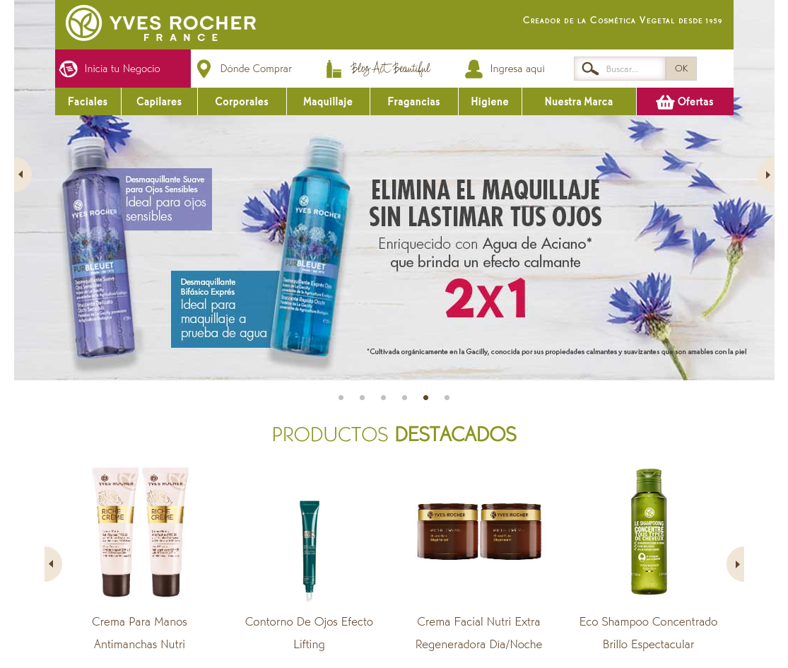

## Sistema de recomendaciones de productos por catálogo

Tonalli Rodríguez \
Ironhack México | Data Analytics | 2020-09-12

## Información general

Las ventas por catálogo forman parte de la cultura mexicana, y se han utilizado principalmente en momentos de crisis de la economía familiar. Quienes realizan esta actividad son, en su mayoría, mujeres que han encontrado en esta actividad una forma de auto emplearse para tener un mejor control de su tiempo y sus otras actividades.

Uno de los problemas al que se enfrentan las vendedoras por catálogo, principalmente las recien iniciadas, es el de realizar recomendaciones a sus clientes, ya sea de manera general o personalizada.

En este proyecto se presenta un sistema de recomendaciones que muestra los 10 productos más similares (basados en sus descripción) a lo que un usuario describe como producto de interés.

Este proyecto está dedicado a todas aquellas mujeres trabajadoras que han dado todo de sí mismas para sacar a sus familias adelante.

## Obtención y manipulación de datos

Para este proyecto, se escogió a la marca [**Yves Rocher**](https://www.yvesrocher.com.mx/) como el catálogo de interés. La extración de datos se realizó mediante [_web scraping_](https://es.wikipedia.org/wiki/Web_scraping) utilizando la herramienta [Selenium](https://selenium-python.readthedocs.io/). Se recolectaron poco más de 600 productos con sus respectivos atributos como precio, descripción, _secretro vegetal_ y categoría.

Para simplificar el modelo, únicamente se tomaron en cuenta los atributos que describen al producto, _i.e._, nombre del producto, descripción y secreto vegetal. El texto fue limpiado y procesado  con la herramienta [NLTK](https://www.nltk.org/) con el fin de descartar las [_palabras vacías_](https://es.wikipedia.org/wiki/Palabra_vac%C3%ADa) y reducir cada palabra a su raíz o [_stem_](https://es.wikipedia.org/wiki/Stemming).

## Sistema de recomendaciones

_Grosso modo_, los sistemas de recomendación pueden sugerir elementos "relevantes" a los usuarios. Los elementos sugeridos son tan relevantes para el usuario como sea posible, de modo que el usuario pueda interactuar con esos elementos: videos, artículos de noticias, productos en línea, etc.

Para poder realizar la recomendación se tiene que elegir una representación de los elementos y determinar la similitud entre los elementos. En este proyecto, se utilizó la representación [TF-IDF](https://es.wikipedia.org/wiki/Tf-idf) de la descripción extendida (documento) de los productos con el fin de tomar en cuenta la relevancia de una palabra en un documento y en una colección de documentos. Con respecto a la similitud de los elementos, se utilizó la [similitud coseno](https://es.wikipedia.org/wiki/Similitud_coseno) por ser independiente de la magnitud de los vectores y del tamaño del espacio vectorial.

## Proyecto a futuro

El siguiente paso es construir una aplicación web _full stack_ donde el motor de búsqueda sea precisamente el sistema de recomendaciones.